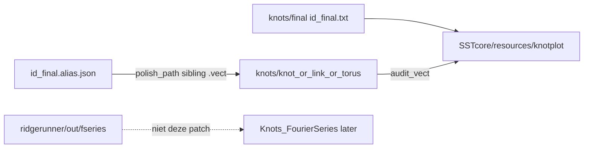

# Fix SSTcore CI + ververs knotplot vanuit Workbench `final/`

Twee lagen in één plan, in deze volgorde: CI-blokkers eerst (anders blijft GitHub rood), daarna de data-refresh. Fseries-mappen gaan **niet** naar `resources/knotplot`.

## Fase A — CI-blokkers (`dev`)

### Node (run 86075912039, alle 12 cellen)

- **Ubuntu:** [`src/core_torsion.cpp`](c:\workspace\projects\SSTcore\src\core_torsion.cpp) regels 19/30 — `std::max({...})` zonder `#include <algorithm>` (GCC 13). macOS/Windows compileren wel (transitieve includes).
- **macOS/Windows `npm test`:** [`tests/test_basic.js`](c:\workspace\projects\SSTcore\tests\test_basic.js) regel 187 verwacht `'Pass'`; na audit H-004 geeft [`evaluatePolygonalSmoothCertificate`](c:\workspace\projects\SSTcore\src\polygonal_smooth_certificate.cpp) alleen `Indeterminate`/`Fail`. Python-test is al bijgewerkt.

### Python-wheels (run 86075963838, zip `Wheels_logs_86075963838.zip`)

Alle 18 matrixcellen (ubuntu/macos/windows × Python 3.9–3.14) rood; alleen **Build source distribution** groen (`SSTcore_source_v0.8.28.zip`). Geen extra fouten naast de twee bekende. Smoke-import slaagde op elke Windows/macOS-cel.

- **ubuntu-latest × 6:** fail in Build wheel — dezelfde `core_torsion.cpp:19/30` `std::max({...})` zonder `<algorithm>`. Geen smoke/pytest.
- **macos-latest × 6 en windows-latest × 6:** wheel + smoke OK; pytest `2 failed, 228 passed, 29 skipped`:
  - [`tests/test_audit_r1_sha256_manifest.py::test_manifest_script_passes`](c:\workspace\projects\SSTcore\tests\test_audit_r1_sha256_manifest.py) — [`scripts/check_source_bundle_manifest.py`](c:\workspace\projects\SSTcore\scripts\check_source_bundle_manifest.py) eist nog plat `resources/ideal.txt`
  - [`tests/test_resources_discovery.py:18`](c:\workspace\projects\SSTcore\tests\test_resources_discovery.py) — `(Path(root) / "ideal.txt")` in `site-packages/SSTcore/resources`

Afgevallen (niet in deze run): Python 3.9 `Path.write_text(..., newline=)` TypeError is weg. H-004 polygonal-smooth komt niet in pytest voor (Python-assert is al `Indeterminate`).

**Fixes A:** `#include <algorithm>`; Node-assert → `Indeterminate` + Fail-mismatch; manifest nested + flat fallback; discovery via `get_ideal_txt_path()` / nested-of-flat. Dat dekt alle 18 wheel-cellen.

`dev` staat niet in push-triggers; retrigger blijft `workflow_dispatch`.

## Fase B — Knotplot-resources uit Workbench `final/`

De bestaande importer ([`tools/knotplot/import_workbench_knotplot.py`](c:\workspace\projects\SSTcore\tools\knotplot\import_workbench_knotplot.py)) pakt nog `*_polish_uniform_N300.txt` uit `knots/knot_*` en kent de nieuwe catalog-status **niet**.

Huidige SSTcore `knot_3.1` is nog `…_rr_020k_polish` (INDEX 2026-08-05). Workbench heeft sindsdien `knots/final/{id}_final.txt` (gedeelde beste snapshot) en nieuwere polish/030k-runs.

### Bronnen (wel / niet)

**Wel — knotplot:**

- [`SST-Workbench/KnotPlot/knots/final/`](c:\workspace\projects\SST-Workbench\KnotPlot\knots\final) — `{id}_final.txt` + `.metrics.json` + `.alias.json`. Geen `.vect` in deze map.
- Matching VECT uit [`knots/knot_*`](c:\workspace\projects\SST-Workbench\KnotPlot\knots\knot_3.1) / `link_*` / `torus_*`: sibling van `alias.polish_path` (`{stem}.vect`), anders alleen het bestand `{stem}.rr/{stem}.final.vect` (niet de hele `.rr/` workspace).

**Niet — fseries (apart later):**

- [`ridgerunner/out/fseries`](c:\workspace\projects\SST-Workbench\KnotPlot\ridgerunner\out\fseries)
- [`ridgerunner/out/10_1`](c:\workspace\projects\SST-Workbench\KnotPlot\ridgerunner\out\10_1), [`3_1`](c:\workspace\projects\SST-Workbench\KnotPlot\ridgerunner\out\3_1), [`3_1p`](c:\workspace\projects\SST-Workbench\KnotPlot\ridgerunner\out\3_1p)

Die blijven buiten `resources/knotplot`. Toekomstige Fourier-refresh hoort bij `resources/Knots_FourierSeries`, niet bij deze import.



### Importer-wijzigingen

In [`import_workbench_knotplot.py`](c:\workspace\projects\SSTcore\tools\knotplot\import_workbench_knotplot.py):

1. **STATUS_RANK** gelijk trekken met Workbench [`classify_catalog_status.py`](c:\workspace\projects\SST-Workbench\KnotPlot\ridgerunner\classify_catalog_status.py):
   - `stalled-not-converged` < `relaxed-seed` < `near-ideal-candidate` < `converged-local-candidate` < `near-ideal` < `certified-ideal`
   - Zonder deze update wordt `knot_3.1` (`converged-local-candidate`) een **stub** en verdwijnt de geometrie.

2. **Prefer shared final** (default): als `knots/final/{id}_final.txt` bestaat (of alias `shared_final` / `source_final` resolve), dat is de canonieke XYZ (`role: shared_final`). AB-XML regenereren vanaf die centerline.

3. **VECT:** uit entity-dir, gekoppeld aan `alias.json` `polish_path`:
   - eerst `{polish_stem}.vect` naast de polish
   - anders `{polish_stem}.rr/{polish_stem}.final.vect` (bestand kopiëren, `.rr/` niet meenemen)

4. **Uniform N300** blijft meeliften als die bij dezelfde polish bestaat (huidige `test_knotplot_index` eist `uniform_n300` voor relaxed). Index-test: relaxed vereist `shared_final` **of** `uniform_n300`; als beide er zijn beide rollen.

5. **Automatisering (toekomst):** geen cross-repo CI-watcher. De importer ís de sync. Na een nieuwe Workbench-final:

```text
python tools/knotplot/import_workbench_knotplot.py --workbench-root <KnotPlot> --dest resources/knotplot
python tools/knotplot/rehash_knotplot_index.py   # indien apart
```

`--dry-run` blijft de review-poort.

### Tests (importer)

Uitbreiden [`tests/test_import_workbench_knotplot.py`](c:\workspace\projects\SSTcore\tests\test_import_workbench_knotplot.py):

- `converged-local-candidate` telt als relaxed bij `--min-status relaxed-seed`; `stalled-not-converged` niet
- synthetic `knots/final/knot_3.1_final.txt` + alias → dest krijgt `shared_final`, AB van die curve
- sibling `.vect` gekopieerd; `.rr/` niet
- als sibling ontbreekt: `{stem}.rr/{stem}.final.vect` wel gekopieerd
- fseries-achtige paden onder `ridgerunner/out` komen niet in het plan

Na echte import: [`tests/test_knotplot_index.py`](c:\workspace\projects\SSTcore\tests\test_knotplot_index.py), inventory/manifest, eventueel `native_length` / trefoil-factoren alleen als de nieuwe geometrie die assertions breekt (zelfde regel als res-3: alleen verwachtingen wijzigen die de data zelf verandert).

### Echte import (na dry-run review)

```text
python tools/knotplot/import_workbench_knotplot.py --workbench-root c:\workspace\projects\SST-Workbench\KnotPlot --dest resources/knotplot
```

Daarna `INDEX.json` + [`tests/data/resource_manifest.json`](c:\workspace\projects\SSTcore\tests\data\resource_manifest.json) regenereren. Optioneel [`resources/knots_data_knotplot.js`](c:\workspace\projects\SSTcore\resources\knots_data_knotplot.js) uit Workbench `knotplot_knots_data.js` als die catalog meegroeit.

Canon blijft Gilbert `ideal.txt`; knotplot blijft `KnotCurveRole.RELAXED_IMPORT`.

## Verificatie

- Fase A: `npm run build:node` + `npm test`; `pytest tests/test_polygonal_smooth_certificate.py tests/test_audit_r1_sha256_manifest.py tests/test_resources_discovery.py`
- Fase B: importer-unittests; daarna volledige `pytest tests/ -q` relevant voor knotplot/resources
- Gebruiker retriggert **Build Module for npm** en **Build Wheels for PyPI** op `dev`

Geen Zenodo/npm/PyPI publish.
