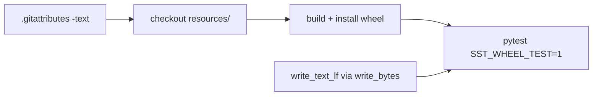

# Fix SSTcore wheel CI (resterende Python 3.9-fout)

## Context uit de logs

Workflow-run [logs_84196920104](c:\Users\oscar\Downloads\logs_84196920104.zip) op branch `sstcore/updating-the-knot-library` (vóór commit `a085761`):

- **Alle OS / 3.10–3.14:** `test_files_match_sha256` + `test_every_manifest_entry_exists_with_matching_sha256` — platform-afhankelijke EOL-bytes vs gemanifesteerde sha256.
- **Alle OS / 3.9 extra:** `TypeError: write_text() got an unexpected keyword argument 'newline'` in `tests/test_import_workbench_knotplot.py` (pathlib kreeg `newline=` pas in 3.10).

Wheel build, auditwheel/delocate en smoke-import slaagden; alleen de pytest-stap faalde.

## Wat al gedaan is

Commit [`a085761`](c:\workspace\projects\SSTcore) (“changed knot sources”) op dezelfde branch:

- [`.gitattributes`](c:\workspace\projects\SSTcore\.gitattributes): `resources/** -text`
- Regenerated [`tests/data/resource_manifest.json`](c:\workspace\projects\SSTcore\tests\data\resource_manifest.json) + [`resources/knotplot/INDEX.json`](c:\workspace\projects\SSTcore\resources\knotplot\INDEX.json)
- [`tests/test_resource_eol_contract.py`](c:\workspace\projects\SSTcore\tests\test_resource_eol_contract.py) + rehash-tool

Lokaal (Python 3.13) slagen de eerder falende hash/EOL-tests al (22 passed). Na een her-run zouden **3.10–3.14** groen moeten zijn; **3.9** faalt nog door `newline=`.

## Resterende fix

Vervang alle `Path.write_text(..., newline="\n")` door een kleine helper die op 3.9 werkt en toch LF forceert:

```python
def write_text_lf(path: Path, text: str) -> None:
    path.write_bytes(text.encode("utf-8"))
```

(`Path.open(..., newline="\n")` mag ook; `write_bytes` is het eenvoudigst en byte-exact.)

Bestanden met de kwarg vandaag:

- [`tools/knotplot/import_workbench_knotplot.py`](c:\workspace\projects\SSTcore\tools\knotplot\import_workbench_knotplot.py) (ab_xml + INDEX.json)
- [`tools/knotplot/rehash_knotplot_index.py`](c:\workspace\projects\SSTcore\tools\knotplot\rehash_knotplot_index.py) (`write_index`)
- [`tools/knotplot/ridgerunner/effort_presets.py`](c:\workspace\projects\SSTcore\tools\knotplot\ridgerunner\effort_presets.py)
- [`tools/knotplot/knotplot_txt_to_vect.py`](c:\workspace\projects\SSTcore\tools\knotplot\knotplot_txt_to_vect.py)

Plaats de helper in bv. [`tools/knotplot/io_text.py`](c:\workspace\projects\SSTcore\tools\knotplot\io_text.py) en importeer die overal.

## Tests

- Unit-test voor `write_text_lf` (LF-bytes, geen `\r\n` op Windows).
- Bestaande suite: `tests/test_import_workbench_knotplot.py`, `tests/test_rehash_knotplot_index.py`, `tests/test_resource_eol_contract.py`, `tests/test_knotplot_index.py`, `tests/test_resource_inventory.py`.
- Idealiter ook even tegen een 3.9-interpreter als die lokaal beschikbaar is; anders is de helper-API zelf het bewijs (geen `newline=`-kwarg).

## Na de codefix

Workflow opnieuw triggeren (`workflow_dispatch` op `sstcore/updating-the-knot-library`). Agents minten/pushen niets naar Zenodo/PyPI; alleen CI groen maken.


