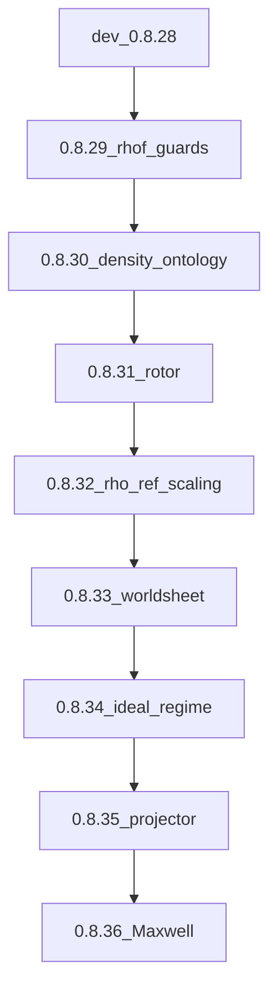

# SSTcore gelijkzetten met SST Canon 0.8.36 (herzien na `dev`)

Vervolg-hoofdplan na [sstcore_full_canon_upgrade_41269b2e.plan.md](sstcore_full_canon_upgrade_41269b2e.plan.md).

## Wat er op de nieuwe branch veranderd is

Analyse van SSTcore branch **`dev`** @ `07700b47` (`Merge branch sstcore/audit-remediation-0.8.28 into dev`):

- **Beide versiepins zijn al 0.8.28** (Optie A): `include/sstcore_version.h`, `setup.py`, `package.json`, `index.js`.
- De hele 0.8.20–0.8.28-ladder staat in de tree, met py+node binds, tests en paired examples. Zie `docs/BINDING_COVERAGE.md` en `docs/RELEASE_NOTES_0.8.28.md`.
- Bestaande conventies: `SHARED_CONVENTIONS.md` + deelplannen 0.8.19–0.8.28. `README.md` zegt nog “na 0.8.28 blijft research-followup op 0.8.28” — dat wordt hier herzien.

**Gevolg:** de vorige Fase 2 (backfill 0.8.20–0.8.28) is **vervallen**. Dit plan is alleen het vervolg **0.8.28 → 0.8.36**.

Al aanwezig (niet opnieuw bouwen):

- `geometry_certificate`, `polygonal_smooth_certificate`, `biot_savart_gate`
- `operational_spacetime`, `qss_spectroscopy`, `pipeline_provenance`
- `core_torsion` + `link_field_gate`, `sst_kam_diagnostics`
- `value_origin` (Fmax `16π²` + `32π²`-trap, `M_0=(m_e/4)L_tot`, `rho_f_two_sigfig`)
- `evidence_report` + `CheckKind`, `sst_action_phase`

Nog **afwezig** (0.8.29–0.8.36): `density_ontology`, `scaling_audit`, rotor/`φ_dyn`, `ideal_knot_regime`, `transverse_projector`, `swirl_tonic`, `spectro_response`, `maxwell_kinetic`, `mechanical_falsifier`, `worldsheet_guards`.

`RHO_FLUID = 7.0e-7` in `SST_Constants.h` is nog een gekalibreerde primitive. Canon 0.8.32 maakt daar `ρ_ref` **[LEGACY REFERENCE]** van. `value_origin.rho_f_two_sigfig` blijft bruikbaar; de primitive-sets moeten wél nieuw.

Lokale uncommitted `CMakeLists.txt` (`EXCLUDE_FROM_ALL` op pybind11) hoort niet bij deze upgrade.

## Architectuur (ongewijzigd)

C++-kernel + dual binds, geen aparte JS-implementatie. Volg `SHARED_CONVENTIONS.md`: Optie A, CI-poort per deelplan, één commit per deelplan, hergebruik `CheckKind` / `CertificateStatus` / `ValueOrigin`.

## Scope

**In:** main-canon formules + computational research-track diagnostics.

**Uit:** Fermat-orphan, Nonrelease v0.3, Zenodo, herimplementatie 0.8.20–0.8.28, Kirchhoff–Cosserat, LIA/KAM op compacte ideal-trefoil, EM-stiffness als gesloten fit.

## Deelplannen 0.8.29–0.8.36

Tijdens uitvoering: nieuwe `deelplan_0_8_2X_*.plan.md`, plus update van `README.md` en `SHARED_CONVENTIONS.md`.

- **0.8.29** — ρ_f provenance/dependency guards (uitbreiden `value_origin` / `canonical_constants`; geen Fermat)
- **0.8.30** — `density_ontology`: `ρ_sub`, `ρ_eff`, `J_ω`, `μ_ℓ`, dimensional validator
- **0.8.31** — rotor/`φ_dyn`/`ℓ_ρ,eq` diagnostics
- **0.8.32** — `ρ_ref` legacy + A/B/C/Q/X `scaling_audit` (breaking)
- **0.8.33** — `worldsheet_guards`
- **0.8.34** — `ideal_knot_regime` (Moffatt–Ricca, compact/slender)
- **0.8.35** — `transverse_projector` (`8π/3`, convention-guard HR vs Gilbert)
- **0.8.36** — Maxwell-stack: spectro, kinetic, falsifier, swirl-tonic, RT DFC/reciprocal

## Verificatie

Start: bestaande suite op `dev` 0.8.28. Per deelplan: SHARED_CONVENTIONS CI-poort. Eind: manifest, examples, `RELEASE_NOTES_0.8.36.md`.
