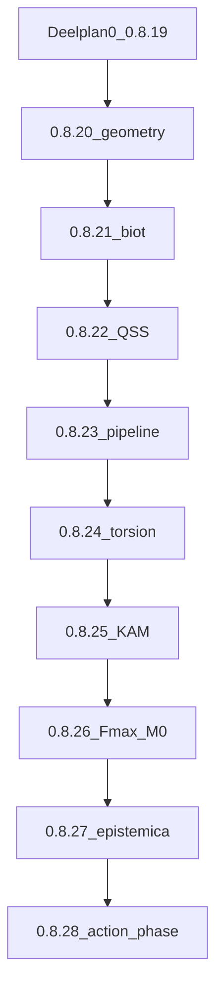

# SSTcore hoofdplan: Canon sync met stapsgewijze versiebumps

## Doel

Breng [SSTcore](c:/workspace/projects/SSTcore) van **0.8.19** (package) / **0.8.20** (canon-tag, mismatch) naar full-programme alignment t/m **Canon v0.8.28**.

**Optie A:** altijd `SSTCORE_VERSION == SSTCORE_CANON_VERSION`. Elke softwarerelease = één Canon-editie.

## Deelplannen (uitvoeringsvolgorde)

| # | Planbestand | Target versie |
| --- | --- | --- |
| 0 | [deelplan_0_baseline.plan.md](deelplan_0_baseline.plan.md) | 0.8.19 |
| 1 | [deelplan_0_8_20_geometry_contact.plan.md](deelplan_0_8_20_geometry_contact.plan.md) | 0.8.20 |
| 2 | [deelplan_0_8_21_certification_biot.plan.md](deelplan_0_8_21_certification_biot.plan.md) | 0.8.21 |
| 3 | [deelplan_0_8_22_spacetime_qss.plan.md](deelplan_0_8_22_spacetime_qss.plan.md) | 0.8.22 |
| 4 | [deelplan_0_8_23_provenance.plan.md](deelplan_0_8_23_provenance.plan.md) | 0.8.23 |
| 5 | [deelplan_0_8_24_core_torsion.plan.md](deelplan_0_8_24_core_torsion.plan.md) | 0.8.24 |
| 6 | [deelplan_0_8_25_kam.plan.md](deelplan_0_8_25_kam.plan.md) | 0.8.25 |
| 7 | [deelplan_0_8_26_fmax_provenance.plan.md](deelplan_0_8_26_fmax_provenance.plan.md) | 0.8.26 |
| 8 | [deelplan_0_8_27_epistemica.plan.md](deelplan_0_8_27_epistemica.plan.md) | 0.8.27 |
| 9 | [deelplan_0_8_28_action_phase.plan.md](deelplan_0_8_28_action_phase.plan.md) | 0.8.28 |

Index: [README.md](README.md) · Conventies: [SHARED_CONVENTIONS.md](SHARED_CONVENTIONS.md)

## Gedeeld eigendom (kort)

- `CertificateStatus` → **0.8.20**; pipeline `PipelineCertificationStatus` → **0.8.23** (niet verwisselen)
- `CheckKind` → **0.8.27**; eerder alleen export-**strings** (zie SHARED_CONVENTIONS)
- \(M_0(T)\) helpers → **0.8.26**; **0.8.28** hergebruikt alleen
- Action–phase → **0.8.28**

## CI-poort (elk deelplan)

Zie [SHARED_CONVENTIONS.md](SHARED_CONVENTIONS.md):

1. Baseline (`pytest` + `npm test` + `test:parity`)
2. Code zonder nieuwe tests
3. Regressie 100%
4. Nieuwe tests
5. Alles 100%
6. **Aparte git-commit** voor dit deelplan (geen bundeling)

Volgende deelplan start pas na die commit.

## Wiring

Zie SHARED_CONVENTIONS wiring checklist + [BINDING_COVERAGE.md](../../docs/BINDING_COVERAGE.md).

## Na 0.8.28 (geen major bump)

Resolved \(E_0\), boost anisotropy, Biot \(N\to32000\), vectorized NumPy — apart follow-up plan, blijft **0.8.28**.

## Succescriteria

- Elk deelplan: CI 100% + gelijke versies + **eigen git-commit**
- Eindstaat: beide **0.8.28** met action–phase + eerdere criteria
- Geen regressie v0.8.12 alignment / resolved-tube
- Enums/vocabulaire volgens SHARED_CONVENTIONS
- Geschiedenis: ~10 commits (0 + 0.8.20…0.8.28), niet één monoliet-commit
